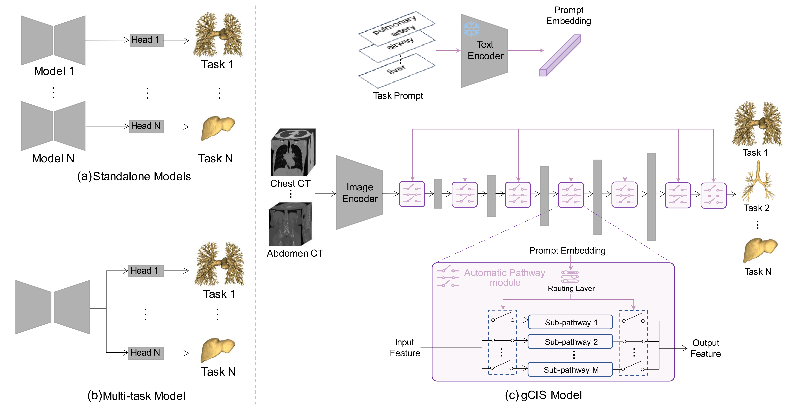
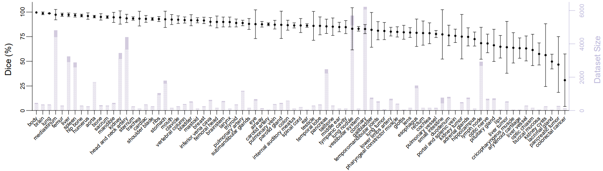

# Towards A General CT Image Segmentation (gCIS) Model for Anatomical Structures and Lesions

This is the official PyTorch implementation for the gCIS.

**Towards A General CT Image Segmentation (gCIS) Model for Anatomical Structures and Lesions**<br>
by Xi Ouyang, Dongdong Gu, Xuejian Li, Wenqi Zhou, QianQian Chen, Yiqiang
Zhan, Xiang Sean Zhou, Feng Shi, Zhong Xue, and Dinggang Shen<br>



## Abstract
We propose a general medical image segmentation (gCIS) model for computerized tomography (CT) images, capable of performing a wide range of segmentation tasks.



## Installation
This code requires PyTorch 1.9+ (not well test on PyTorch 2.0, so please use the Pytorch 1.9+ version) and python 3.6+. If using Anaconda, you can create a new environmnet for gCIS

```bash
conda create -n gcis python=3.8
conda activate gcis
conda install pytorch==1.13.1 torchvision==0.14.1 torchaudio==0.13.1 pytorch-cuda=11.6 -c pytorch -c nvidia # please refer to the pytorch official document
```

Install other dependencies (e.g., monai, nibabel, open_clip_torch) by

```bash
pip install -r requirements.txt
```

The installation of the opensource toolkits can take from a few minutes to tens of minutes, depending on the Internet speed

## Data Preparation

Due to the commercial and privacy issue from our partners, we are working on releasing partial in-house data with the consent of everyone. Before that, you can try our model in the public datasets used in our paper:
- [Head and neck organ-at-risk CT & MR segmentation (HaN-Seg) Challenge](https://han-seg2023.grand-challenge.org/)
- [The Cancer Imaging Archive, TCIA](https://www.cancerimagingarchive.net/)
- [Medical Segmentation Decathlon, MSD](http://medicaldecathlon.com/)
- [Segmentation of Organs-at-Risk and Gross Tumor Volume of NPC for Radiotherapy Planning, SegRap](https://segrap2023.grand-challenge.org/dataset/)
- [Multi-Atlas Labeling Beyond the Cranial Vault, BTCV](https://www.synapse.org/#!Synapse:syn3193805/wiki/217789)
- [Liver Tumor Segmentation (LiTS) Challenge](https://competitions.codalab.org/competitions/17094)
- [Kidney Tumor Segmentation (KiTS) Challenge](https://kits-challenge.org/kits23/)
- [Whole abdominal ORgan Dataset, WORD](https://github.com/HiLab-git/WORD)
- [CT-ORG dataset](https://www.nature.com/articles/s41597-020-00715-8)
- [Multi-Modality Abdominal Multi-Organ Segmentation (AMOS) Challenge](https://zenodo.org/record/7262581)


We use the MONAI framework in this repo, so just follow the data preparetion with <a href="https://github.com/Project-MONAI/tutorials#3d-segmentation">MONAI segmentation examples</a>. The most important is to prepare the dataset json files, containing the "training" and "validation" set. For each case in this json file, a "prompt" item is required along with the "image" key and "label" key. Here is the format of the json file:

``` 
{
  "training": [
    {
      "image": "/path/to/image.nii.gz",
      "label": "/path/to/mask.nii.gz",
      "prompt": "xxx"
    },
    ...
  ]
  "validation": [
    {
      "image": "/path/to/image.nii.gz",
      "label": "/path/to/mask.nii.gz",
      "prompt": "xxx"
    },
    ...
  ]
}
```


## Training

### Pretrain the model with automatic pathway modules

First, download the weight of the CLIP model used in our codes. I have uploaded the opensource weights in <a href="https://drive.google.com/drive/folders/14OkFOIb_LmSrRGIKV2q0uw8_p99P1hFc?usp=sharing">Google Drive</a> or <a href="https://pan.baidu.com/s/1QMFvy69bwMGoixoVZ6N0lg ">Baidu Yun</a> (Code: 86uf) for the convenience of downloading. Please download all the files in this shared folder and find the following code in `main.py`:

``` bash
prompt_model, _, preprocess = open_clip.create_model_and_transforms('ViT-B-32-quickgelu', pretrained='laion400m_e32', device=torch.device('cuda:0'), cache_dir="/path/to/clip_weights")
```

Then, modify the `/path/to/clip_weights` path to the location of the clip weights folder downloaded in your computer.

Training the model with automatic pathway modules from scrach:

``` bash
python main.py --json_list=<json-path> --feature_size=48 --roi_x=128 --roi_y=128 --roi_z=128 --ap_num=6 --use_gradcheckpoint --batch_size=<batch-size> --max_epochs=<max-epochs> --save_checkpoint --logdir=v1-pretrain --use_prompt
```

The number of `feature_size` should be divisible by 12, which is used to control the model size. In addition, `use_gradcheckpoint` enables the use of gradient checkpointing for memory-efficient training. `use_prompt` should not be removed when training the model with automatic pathway modules. `ap_num` is the number of pathway in each automatic pathway module. `save_checkpoint` is used to save the checkpoint. `logdir` is the model saveing folder, which will be automatic created in the `runs` folder. It will store the tensorboard information and the checkpoints. This command defaults to using amp for training, and you can add `noamp` to close the amp training.

Training the model with automatic pathway modules from the pretrain model:

```bash
python main.py --json_list=<json-path> --feature_size=48 --roi_x=128 --roi_y=128 --roi_z=128 --ap_num=6 --use_gradcheckpoint --batch_size=<batch-size> --max_epochs=<max-epochs> --save_checkpoint --logdir=v1-pretrain --use_prompt --pretrained=<model-path>
```

Due to the commercial and privacy issue from our partners, the pretrained model on large dataset could not be included. We recommand to use some open-source pretrained weights. Thanks for the great work of [SwinUNETR](https://github.com/Project-MONAI/research-contributions/tree/main/SwinUNETR), you can download their self pretrained weights [here](https://github.com/Project-MONAI/MONAI-extra-test-data/releases/download/0.8.1/model_swinvit.pt) (the `feature_size` of this pretrained model is 48). Or, you can download their pretrained models on BTCV dataset: [swin_base](https://github.com/Project-MONAI/MONAI-extra-test-data/releases/download/0.8.1/swin_unetr.base_5000ep_f48_lr2e-4_pretrained.pt), [swin_small](https://github.com/Project-MONAI/MONAI-extra-test-data/releases/download/0.8.1/swin_unetr.small_5000ep_f24_lr2e-4_pretrained.pt), [swin_tiny](https://github.com/Project-MONAI/MONAI-extra-test-data/releases/download/0.8.1/swin_unetr.tiny_5000ep_f12_lr2e-4_pretrained.pt) (`feature_size` of these pretrained models are 48, 24, 12, respectively). You should use `pretrained` to input the path of pretrained model. These weights can provide a good initialization point for the training of swin backbone.

### Finetune the model in single task
After the model pretraining with multiple automatic pathway modules in large dataset, you can further finetune the model to get better performance. First, you should only select the data of the tasks belonging to each sub-pathway to further update the parameters while other parameters in the model are fixed. Then you use all the data to update the parameters except the automatic pathway modules while fixing the pathway selection. Since this process is quite complicated, we recommand to directly fix the swin encoder part, and finetune the model into each single task. Also, you can use this method to fast transfer the pretrained model into a new task with limited data.

First, you should find the select pathways corresponding to the target task.
Also you should find the following code in `test.py`:

``` bash
prompt_model, _, preprocess = open_clip.create_model_and_transforms('ViT-B-32-quickgelu', pretrained='laion400m_e32', device=torch.device('cuda:0'), cache_dir="/path/to/clip_weights")
```

Then, modify the `/path/to/clip_weights` path to the path of the folder of clip weights in your computer.

```bash
python test.py --model=<pretrain-model-path> --json_list=<json-path> --feature_size=48 --roi_x=128 --roi_y=128 --roi_z=128 --ap_num=6 --use_prompt --display_path
```

`model` should be set the path of the pretrained model pt file from the first step. `ap_num` should match the training setting of the pretrained model. You can set only one case in the "validation" set of json file, and set the "prompt" into the target task. You can get the pathway index of each automatic pathway in the terminal like:

```
...
decoder10 layer (position 1) path index:  2
decoder5 layer (position 2) path index:  1
decoder4 layer (position 3) path index:  3
decoder3 layer (position 4) path index:  5
decoder2 layer (position 5) path index:  3
decoder1 layer (position 6) path index:  6
out layer (position 7) path index:  6
...
```

From this example, you can bulid a pathway index list: `[2, 1, 3, 5, 3, 6, 6]`. Then you can finetune this pretrained model by:

```bash
python main.py --json_list=<json-path> --feature_size=48 --roi_x=128 --roi_y=128 --roi_z=128 --batch_size=<batch-size> --max_epochs=<max-epochs> --save_checkpoint --logdir=v1-finetune --finetune --ap_model=<pretrain-model-path> --path_selection="2,1,3,5,3,6,6"
```

`path_selection` refers to the selected pathways, contains all the indexes in 7 automatic pathway modules. The index numbers are seperated with ",". `finetune` is used to fix the parameters of swin backbone. `ap_model` should be set the path of the pretrained model pt file from the first step. Since the swin backbone is fixed, do not add `use_gradcheckpoint` here to avoid the gradient updating problem.

Due to the commercial and privacy issue from our partners, the finetune model on our large dataset could not be included.

## Testing

### Testing the model with automatic pathway modules
Here, you can use the following scripts to get the mask result corresponding to the prompt input.
Also you should find the following code in `test.py`:

``` bash
prompt_model, _, preprocess = open_clip.create_model_and_transforms('ViT-B-32-quickgelu', pretrained='laion400m_e32', device=torch.device('cuda:0'), cache_dir="/path/to/clip_weights")
```

Then, modify the path `/path/to/clip_weights` to the path of the folder of clip weights in your computer.

```bash
python test.py --model=<pretrain-model-path> --json_list=<json-path> --feature_size=48 --roi_x=128 --roi_y=128 --roi_z=128 --ap_num=6 --use_prompt
```

`model` should be set to the path of the model pt file from the first pretraining step. `ap_num` should match the training setting of the pretrained model. You should set the "prompt" of each cases into the target task in the json file.

### Testing the model of single task


Clip model is not need in this test script.

```bash
python test.py --model=<pretrain-model-path> --json_list=<json-path> --feature_size=48 --roi_x=128 --roi_y=128 --roi_z=128
```

`model` should be set to the path of the model file from the second finetune step. The inference time varies for different image size and differnet computers. For a coronary CTA image (spacing: 0.42mm * 0.42mm * 0.42mm, size: 512 * 512 * 425), the inference time on NVIDIA A4000 card is less than one minute (using cropped patches of 96 * 96 * 96).

Due to the commercial and privacy issue from our partners, we release several weights for some downstream tasks in <a href="https://drive.google.com/drive/folders/1VwtsJ_8bfqk1ixK5vsq-5hEvcDI2wZz2?usp=sharing">Google Drive</a> or <a href="https://pan.baidu.com/s/1yaa0FcRO6_ozDl0EoJl7bw">Baidu Yun</a> (Code: vid7) for the convenience of downloading. In each folder of our released files, "params.pth" is the model weight, which has been trimmed from the multi-task model for the specific task. So all the model files share the same encoder weights. Also, we release some test cases of each task for quick verification. The "xxx.csv" contains the information for the original images and masks of the test cases.

## Acknowledgments
We thank for these great opensource projects: [MONAI](https://monai.io/), [Open CLIP](https://github.com/mlfoundations/open_clip), and [SwinUNETR](https://github.com/Project-MONAI/research-contributions/tree/main/SwinUNETR).